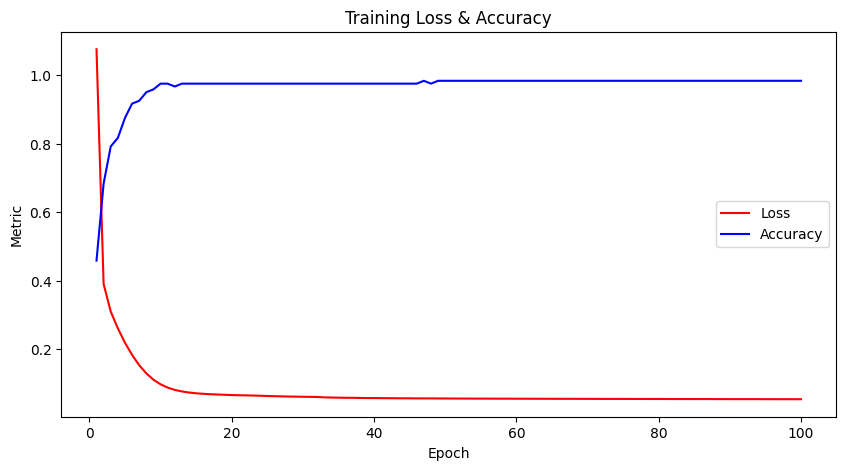

# MLP-from-Scratch
This project demonstrates building a Multi-Layer Perceptron (MLP) neural network from scratch in Basic Python ONLY, WITHOUT ANY LIBRARIES.
# MLP from Scratch on Iris Dataset

This repository implements a simple Multi-Layer Perceptron (MLP) neural network **from scratch** in Python, without using any deep learning frameworks. The model is trained and evaluated on the classic Iris dataset.

## Results

The MLP model was trained on the Iris dataset for 100 epochs. Below are key performance milestones during training:

| Epoch | Loss   | Accuracy |
|-------|--------|----------|
| 1     | 1.0755 | 45.83%   |
| 10    | 0.0973 | 97.50%   |
| 20    | 0.0659 | 97.50%   |
| 30    | 0.0608 | 97.50%   |
| 50    | 0.0558 | 98.33%   |
| 100   | 0.0537 | 98.33%   |

On the test set, the model achieved:

- **Test Loss:** 0.0771  
- **Test Accuracy:** 100.00%

